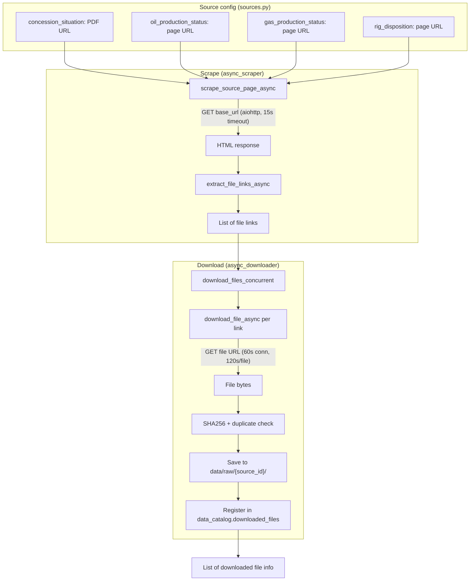

# Pipeline Data Flow

This document illustrates how data moves through the pipeline and where the **file acquisition** step can fail.

---

## High-level flow

```
┌─────────────────────────────────────────────────────────────────────────────────────────┐
│  STEP 1: FILE ACQUISITION (scrape + download)  ← often fails here                        │
├─────────────────────────────────────────────────────────────────────────────────────────┤
│  Sources (NUPRC)  →  Scrape HTML  →  Extract file links  →  Download files  →  data/raw │
└─────────────────────────────────────────────────────────────────────────────────────────┘
                                                    │
                                                    ▼
┌─────────────────────────────────────────────────────────────────────────────────────────┐
│  STEP 2: EXTRACT & LOAD BRONZE                                                          │
│  data/raw  →  Parse Excel/PDF  →  Load to bronze.*_raw (JSONB)                          │
└─────────────────────────────────────────────────────────────────────────────────────────┘
                                                    │
                                                    ▼
┌─────────────────────────────────────────────────────────────────────────────────────────┐
│  STEP 3: TRANSFORM TO SILVER                                                            │
│  bronze  →  Fuzzy column matching, schema drift  →  silver.*                             │
└─────────────────────────────────────────────────────────────────────────────────────────┘
                                                    │
                                                    ▼
┌─────────────────────────────────────────────────────────────────────────────────────────┐
│  STEP 4: LOAD WAREHOUSE                                                                 │
│  silver  →  Dimensional model (star schema)  →  warehouse (facts + dimensions)          │
└─────────────────────────────────────────────────────────────────────────────────────────┘
                                                    │
                                                    ▼
┌─────────────────────────────────────────────────────────────────────────────────────────┐
│  STEP 5: DIAGRAMS & CATALOG                                                             │
│  Generate Mermaid ER diagram; refresh data_catalog.available_tables                     │
└─────────────────────────────────────────────────────────────────────────────────────────┘
```

---

## Mermaid: End-to-end pipeline

```mermaid
flowchart LR
    subgraph step1["Step 1: File acquisition"]
        S1A[Sources config] --> S1B[Scrape pages]
        S1B --> S1C[Extract links]
        S1C --> S1D[Download files]
        S1D --> S1E["data/raw/"]
    end

    subgraph step2["Step 2: Bronze"]
        S1E --> S2A[Parse Excel/PDF]
        S2A --> S2B["bronze.*_raw"]
    end

    subgraph step3["Step 3: Silver"]
        S2B --> S3A[Fuzzy match]
        S3A --> S3B["silver.*"]
    end

    subgraph step4["Step 4: Warehouse"]
        S3B --> S4A[Star schema]
        S4A --> S4B["warehouse"]
    end

    subgraph step5["Step 5: Catalog"]
        S4B --> S5A[Diagrams]
        S5A --> S5B[data_catalog]
    end
```



---

## File acquisition (Step 1) – detailed flow

Step 1 is implemented as: **scrape** → **extract links** → **download**. Code entry: `scrape_and_download_sources()` in `pipeline_executor.py`, which calls `scrape_and_download_sources_async()` in `async_pipeline_executor.py`.



**Key modules:**

| Phase    | Module                 | Function / role |
|----------|------------------------|------------------|
| Scrape   | `async_scraper.py`     | `scrape_all_sources_async()` → `scrape_source_page_async()` → `extract_file_links_async()` |
| Download | `async_downloader.py`  | `download_files_concurrent()` → `download_file_async()` |
| Config   | `sources.py`           | `SOURCES` (base_url per source), `get_all_sources()` |

---

## Why file acquisition often fails

Failures in Step 1 usually come from **scraping** or **downloading** (or both). Below are the main causes and what to check.

### 1. Scraping fails (no links or exception)

| Cause | What you see | What to do |
|-------|----------------|------------|
| **Network unreachable** | "Scraping failed with error: ..." or timeout | Check firewall, VPN, DNS; ensure the machine can reach `https://www.nuprc.gov.ng`. |
| **HTTP 403 / blocking** | Scrape returns 403 or empty page | Site may block non-browser requests. Try from same network in a browser; consider different User-Agent or proxy (not implemented by default). |
| **Page structure changed** | "Found 0 files for Oil Production Status" | NUPRC may have changed HTML. Inspect the live page; update `extract_file_links_async()` in `async_scraper.py` (e.g. selectors for `<a href="...">`). |
| **Timeout** | "Scraping timed out after 60 seconds" | 60s total for all sources. Slow network or slow server; increase timeout in `async_pipeline_executor.py` (e.g. `wait_for(..., timeout=60.0)`) or fix network. |
| **SSL / TLS error** | "Failed to scrape ...: [SSL: ...]" | Certificate or TLS version issue. Check Python and system CA store; test with `curl -v https://www.nuprc.gov.ng/...`. |

**Where it’s logged:** Run logs get "Scraping failed with error: {message}" or "Scraping timed out...". The backend now logs the full exception so you can see the exact error (e.g. connection timeout, 403).

### 2. Download fails (0 new files)

| Cause | What you see | What to do |
|-------|----------------|------------|
| **All duplicates** | "Downloaded 0 new files, skipped N duplicates" | Expected if data is already in bronze. Pipeline can still continue using existing bronze data. |
| **Per-file timeout** | "Failed: filename.xlsx" in logs; 0 new files | 120s per file. Large or slow files; increase timeout in `download_files_concurrent()` (e.g. `asyncio.wait_for(..., timeout=...)`) or reduce concurrency. |
| **Per-source timeout** | "Download from X timed out after 5 minutes" | 5 min per source. Too many or too large files; increase timeout in `async_pipeline_executor.py` (300.0) or run with fewer sources. |
| **HTTP 404/403 on file URL** | "Failed to download https://...: 404" (in run logs) | Link from scrape is broken or protected. Check URL in browser; fix scraper or source list. |
| **File too large** | "File too large: N bytes (max 100MB)" | Increase `max_size` in `download_file_async()` or exclude very large files in scraper. |
| **Disk / permissions** | Exception when writing to `data/raw/` | Ensure `data/raw/` is writable and disk has space; run backend from a directory where `Path("data/raw")` is valid. |

**Where it’s logged:** Run logs: "Downloaded X new files, skipped Y duplicates", "Failed: filename", "Download from X timed out...". Failed download exceptions are now logged with the full error message.

### 3. No bronze data and no new files

If Step 1 downloads **0 new files** and there is **no existing bronze data**, the pipeline marks the run as **failed** with:  
"No files downloaded and no existing data. Check source URLs."

So “file acquisition failed” from the pipeline’s point of view = either an exception in Step 1, or 0 new files with 0 bronze rows.

---

## Quick checks when file acquisition fails

1. **Run logs (DB)**  
   ```sql
   SELECT level, message, created_at
   FROM pipeline_log
   WHERE run_id = '<your_run_id>'
   ORDER BY created_at ASC;
   ```
   Look for the first ERROR or WARN in Step 1 (scraping/downloading).

2. **Backend terminal**  
   Look for `[STEP 1] FAILED:` or `[scrape_and_download_sources] EXCEPTION:` and the following traceback.

3. **Network**  
   From the same machine as the backend:
   - `curl -I https://www.nuprc.gov.ng/oil-production-status-report/`
   - Open the same URLs in a browser.

4. **Source config**  
   In `app/services/sources.py`, confirm `base_url` values are correct and match current NUPRC pages (no redirects to “page not found”).

5. **Data directory**  
   Ensure `data/raw/` exists and is writable relative to the process working directory (e.g. run backend from repo root).

---

## Summary

- **File acquisition** = Step 1: scrape NUPRC pages → extract PDF/Excel links → download files to `data/raw/` and register in `data_catalog.downloaded_files`.
- It usually fails due to **network/timeouts**, **scrape (0 links or exception)**, or **download (timeouts, HTTP errors, disk)**. Run logs and the backend terminal now include the concrete exception messages for scrape and download so you can see the exact reason.
